# Spotter-Shooter

**Spotter-Shooter is an AI-assisted threat hunting operations console for professional security teams.**

It is built around a simple operational idea: let autonomous hunting agents act as *spotters* across large telemetry sets, then let human analysts act as *shooters* who validate, dismiss, escalate, and brief leadership.

The goal is not to replace analysts. The goal is to compress the time between **massive log volume** and **actionable, evidence-backed leads**.

---

## Why this matters

Modern security teams are buried under telemetry. A realistic hunt may involve millions of endpoint, network, identity, cloud, and application events. Analysts lose time on:

- forming the first useful query
- pivoting between datasets
- separating high-signal leads from noise
- writing findings in a clear operational format
- keeping commanders updated while triage is still underway

Spotter-Shooter gives the team an operator-focused workflow:

1. **Deploy / configure the mission**
2. **Connect telemetry**
3. **Select built-in or custom agents**
4. **Launch the hunt**
5. **Review agent findings in Analyst View**
6. **Escalate validated findings into cases**
7. **Brief leadership in Commander View**

---

## Current MVP capabilities

### Deployment console

A guided deployment workflow for mission setup:

- infrastructure health check
- mission document upload path
- Elastic telemetry test
- model provider test
- agent selection
- hunt launch

### Bring-your-own Elastic hunting lab

Spotter-Shooter is designed to connect to an operator-controlled Elastic/Kibana lab. The public repository does **not** connect to any private hosted telemetry system by default.

For the internal evaluation demo, the platform was tested against an Elastic lab containing over **3.2 million searchable security events** from BOTSv3, APT29, APT3, LSASS campaigns, Log4Shell, and Golden SAML/ADFS datasets. External users should import those datasets into their own Elastic instance or point the deployment wizard at an existing lab they control.

Agents query whichever Elastic endpoint and index patterns the operator configures during deployment. This keeps private data private and makes the project reproducible in air-gapped or customer-controlled environments.

### OpenRouter-backed agent summaries

Agent findings are summarized through OpenRouter-backed LLM calls. Findings include:

- title
- severity
- explanation
- key fields
- matched event counts
- raw log sample
- recommended next question
- confidence
- model used

### Analyst View

The analyst console is designed for triage:

- view agent findings
- filter by severity
- inspect raw evidence
- review agent rationale
- dismiss weak findings
- escalate validated findings

### Commander View

The commander console gives leadership a high-level operational picture:

- active findings
- agent activity feed
- ASOM-style progress lines
- threat actor / attribution notes
- cases and escalation state
- event counts by agent


### Case management and analyst collaboration

Validated findings can now become durable cases instead of one-off alert cards. The case workbench supports:

- multiple alerts linked into one case
- multiple analysts dogpiling on one case
- case members with rank, work role, skill level, branch, team, certifications, degrees, and experience
- case indicators with hover/click relationship lookup across other cases and events
- timeline entries for analyst notes, admin requests, enrichment, containment, and findings
- AI-style final output including BLUF / "So What", 5 Ws, technical summary, way ahead, and analyst/team attribution

### Cyber Protection Team profiles

The platform includes Cyber Protection Team and National Cyber Protection Team objects. Admins can create and edit teams with:

- team type: CPT or NCPT
- team number and name
- logo/picture URL
- location
- phone number
- email
- notes, mission, and coverage details
- team lead, deputy team lead, planner, and NCOIC assignments
- member list generated from assigned analyst accounts

Seeded CPTs: 100, 101, 150, 151, 152, 153, 154, 155, 156, 200, 201, 400, 401, 600, 503.

Seeded NCPTs: 01, 03, 05, 23.

### Role-based views: analyst, commander, admin

Privileges are now `analyst`, `commander`, and `admin`, and they drive the operations console directly:

- **Admin** sees all three surfaces: Analyst View, Commander View, and the Admin console, with a header switcher.
- **Analyst** sees only the Analyst View (plus self-profile editing).
- **Commander** sees only the Commander View (plus self-profile editing).

The first admin account is created during deployment (Review & Launch step); launch is blocked until an admin exists.

### Continuous hunting on new data

The agent cycle no longer re-emits a fixed set of findings. Each pass, agents count matching documents in the configured Elastic index patterns and raise a **new alert only when new documents appear** (per-agent baselines are stored in `agent_state`). Alerts are never fabricated: if Elastic is unreachable or a query matches nothing, no event is created.

**Index scope:** by default agents hunt **all non-system indices** (`*,-.*`), so data loaded under a brand-new index name is picked up automatically. During setup, the telemetry test discovers every index in the cluster and lets the operator click indices in or out of scope; a manual override pattern is also supported. The choice persists in `app_settings` across API restarts and is editable later in Admin console → Agent Management.

The operations console is **live**: it polls for new findings every 15 seconds, slides new alerts into the list with a toast notification, and shows an "Agents Hunting / Idle / Paused" badge in the header driven by real last-cycle timestamps.

### Analyst hunt signatures

Analysts can create simple signatures — an optional ECS field (`source.ip`, `dns.question.name`, `user.name`, ...) plus a value — from the Signatures button in the ops toolbar. Signatures feed the built-in **Signature Match Agent**: when new telemetry matches, it raises an alert and sends the creating analyst a notification ("your signature popped"). Agent creation remains admin-only; signatures are analyst-level.

### Hardening and operator experience

- **Triage requires login** — anonymous visitors cannot dismiss or escalate alerts, and every triage action is attributed to the logged-in analyst (not a default account).
- **Login lockout** — five failed attempts in ten minutes temporarily lock the account; failures and lockouts are audited.
- **Server-side audit trail** — logins, account/team/signature changes, escalations, dismissals, case status changes, launches, and platform resets are recorded automatically (Admin console → Audit Trail).
- **Case status workflow** — open → triage → review → closed, changeable from the case workbench with an automatic timeline entry.
- **Alert status filters** — Active / Escalated / Dismissed / All chips; dismissed alerts are hidden by default.
- **Kibana deep links** — the Kibana button on an alert opens Discover with that agent's query prefilled.
- **Honest health checks** — the deployment console reports real Elasticsearch reachability, model-route configuration, and Zeek availability instead of hardcoded values.
- **Unit branding** — the shield insignia appears across the consoles (header, login, empty states, launch overlay) with subtle motion design.

### Redeployment

Admin Tools (ops console) and the Admin console Settings tab include a **Redeploy** action that wipes all operational data — alerts, cases, accounts, teams, signatures, settings — re-seeds defaults, and returns to the deployment wizard to start setup over. It requires typing `REDEPLOY` to confirm.

### Accounts, roles, and read-only mode

After installation, unauthenticated visitors see a read-only banner:

```text
Read-only view. Please login or Create an Account.
```

Account creation lives in the admin/account panel. Analysts can edit their own account. Admins can edit all accounts and create/update Cyber Protection Teams.

The login flow includes a challenge-code framework for email or cell phone verification. 2FA can be enabled or opted out during deployment from the Review & Launch screen, and admins can change it later from Operational Console → Admin Tools. In a local/demo environment without `SMTP_URL` or `SMS_WEBHOOK_URL`, an enabled 2FA flow shows the code in the UI for testing. In production, configure one of those delivery endpoints so the code is delivered out-of-band.

### Analyst and Commander chatbots

Analyst View and Commander View include a context-aware chatbot. It can answer operational questions, summarize current cases and events, and suggest a way ahead. When OpenRouter is configured, the chatbot uses the configured model. Otherwise it falls back to deterministic guidance from the current case/event context.

### PCAP to Zeek to Elastic ingestion

The PCAP upload path is now functional. Operators can upload `.pcap`, `.pcapng`, or `.cap` files, run them through a Zeek container, and bulk-index the generated JSON logs back into Elastic under `spotter-zeek-*` indices. The UI reports the created index, Zeek log types, and indexed document count.

### Kibana handoff

The operations header includes a **Go To Kibana** action. It opens the configured Kibana URL from the setup/backend config. This allows analysts to pivot from a Spotter-Shooter finding into raw Kibana investigation without hardcoding a private lab into the public repository.

### Agent administration

The admin panel supports agent lifecycle management:

- view built-in agent status
- view custom agent status
- see event counts by agent
- create custom agents
- test custom agents against Elastic
- enable / disable custom agents
- archive custom agents

---

## Built-in agent roster

Spotter-Shooter includes 11 built-in agents.

### Tier 1: default network agents

- New Domain Agent
- New External IP Agent
- DGA Agent
- Beaconing Agent
- JA3/JA4 Agent
- Threat Intel Correlation Agent
- ASOM Drafting Agent

### Tier 2: optional host agents

- Sysmon Process Anomaly Agent
- Windows Logon Anomaly Agent
- PowerShell Activity Agent
- Service Account Activity Agent

Host-based observations are intentionally advisory. Process behavior, authentication patterns, and account activity still require analyst review and environment-specific context.

---

## Demo value proposition

Spotter-Shooter is meant to demonstrate a measurable analyst-augmentation loop:

### Before

An analyst starts with millions of logs and must manually decide where to begin.

### After

Agents generate initial evidence-backed leads, and the analyst spends time validating and escalating instead of searching blindly.

### What to measure

- Time to first useful lead
- Time to first validated pivot
- Number of accepted findings
- Number of false positives
- Analyst confidence
- Commander briefing quality
- Final incident narrative quality

---

## Visual walkthrough

The screenshots below are intended to make the value of Spotter-Shooter obvious at a glance. Add image files under `docs/screenshots/` using the filenames shown below, and GitHub will render the walkthrough automatically.

### 1. Deployment Console — mission readiness

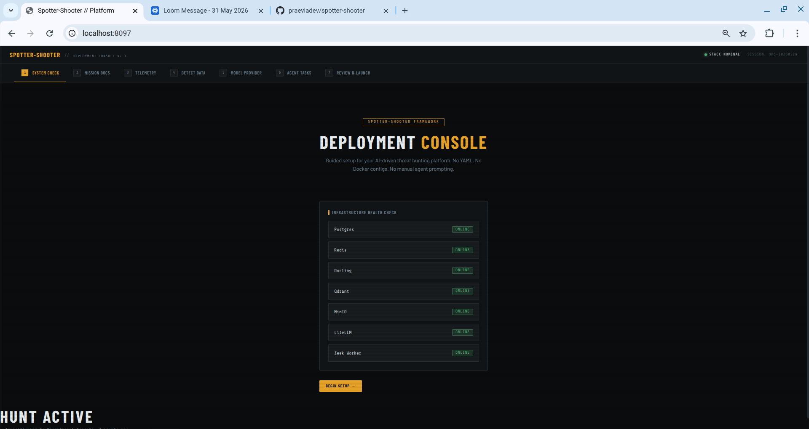

Spotter-Shooter opens with a deployment console instead of a generic dashboard. The first screen gives the operator an immediate readiness check across the supporting services required for an AI-assisted hunt: Postgres, Redis, Elastic, Qdrant, MinIO, model routing, and worker processes.

This matters because the platform is designed for controlled security operations. Before the hunt begins, the operator can verify that the mission stack is healthy and that the system is ready to ingest documents, query telemetry, run agents, and preserve analyst decisions.

**Suggested capture:** the first deployment page with all services showing online.

---

### 2. Elastic telemetry connection — proof of real data

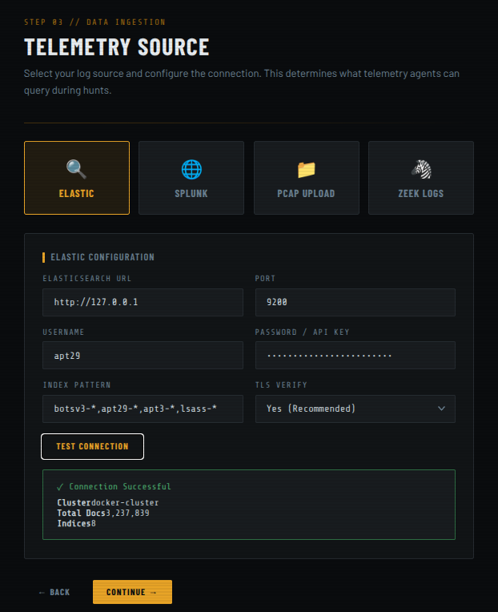

The telemetry test is one of the most important screenshots. It shows that Spotter-Shooter is not just displaying static UI cards; it is connected to a live Elastic lab with over **3.2 million searchable security events**.

The current lab includes BOTSv3, APT29, APT3, LSASS campaign telemetry, Log4Shell, and Golden SAML/ADFS data. This gives the demo realistic volume, noise, and adversary-emulation evidence for measuring analyst-vs-agent performance.

**Suggested capture:** the Elastic connection result showing `3,237,839` total documents and the loaded indices.

---

### 3. Agent selection — modular hunting capability

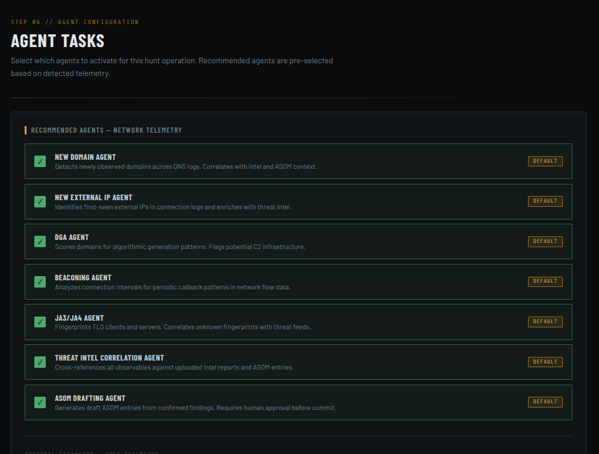

Spotter-Shooter uses a modular agent model. Operators can start with default network-focused agents, then add host-focused agents when they have enough operational context to evaluate process, authentication, and account behavior.

This distinction is important: host-based AI observations should be treated as leads requiring analyst validation, not final determinations. The product is designed to preserve that professional analyst-in-the-loop workflow.

**Suggested capture:** the agent selection step showing Tier 1 network agents and Tier 2 host agents.

---

### 4. Hunt launch — from setup to active operation

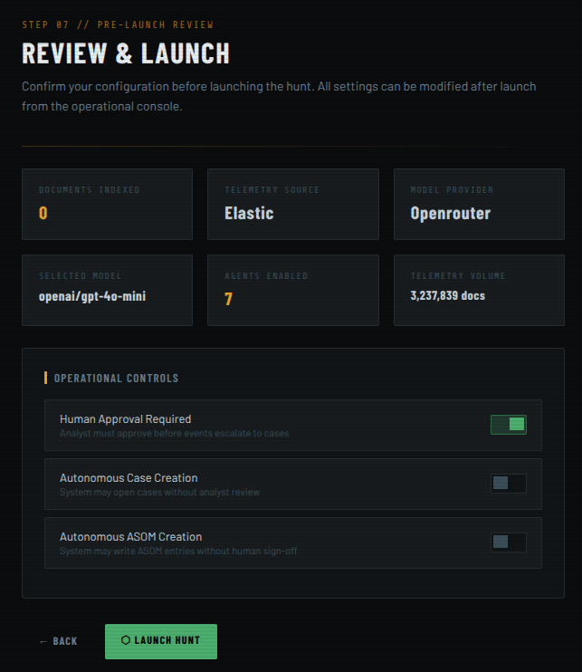

The launch overlay marks the transition from configuration to active hunt. At this point, selected agents begin querying telemetry, producing findings, and preparing leads for analyst triage.

This gives supervisors a clean mental model: deploy the mission, connect the data, choose the agents, then launch the hunt.

**Suggested capture:** the launch overlay with the hunt marked active.

---

### 5. Analyst View — evidence-backed finding detail

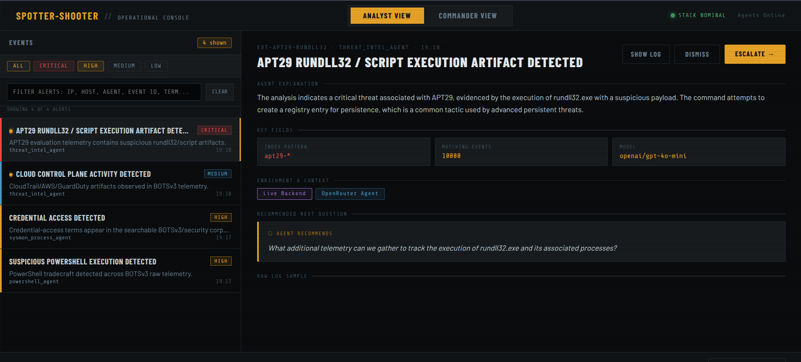

Analyst View is where agent output becomes operationally useful. Each finding includes a severity, explanation, key fields, matching event count, model attribution, raw evidence, and a recommended next question.

For the APT29 evaluation data, a strong screenshot is the rundll32/script execution finding. It demonstrates that the platform can surface a concrete adversary-emulation artifact and explain why it matters without hiding the evidence from the analyst.

**Suggested capture:** an APT29 finding with `Model: openai/gpt-4o-mini`, matching events, agent explanation, and recommended next question visible.

---

### 6. Raw log evidence — grounded, not generic

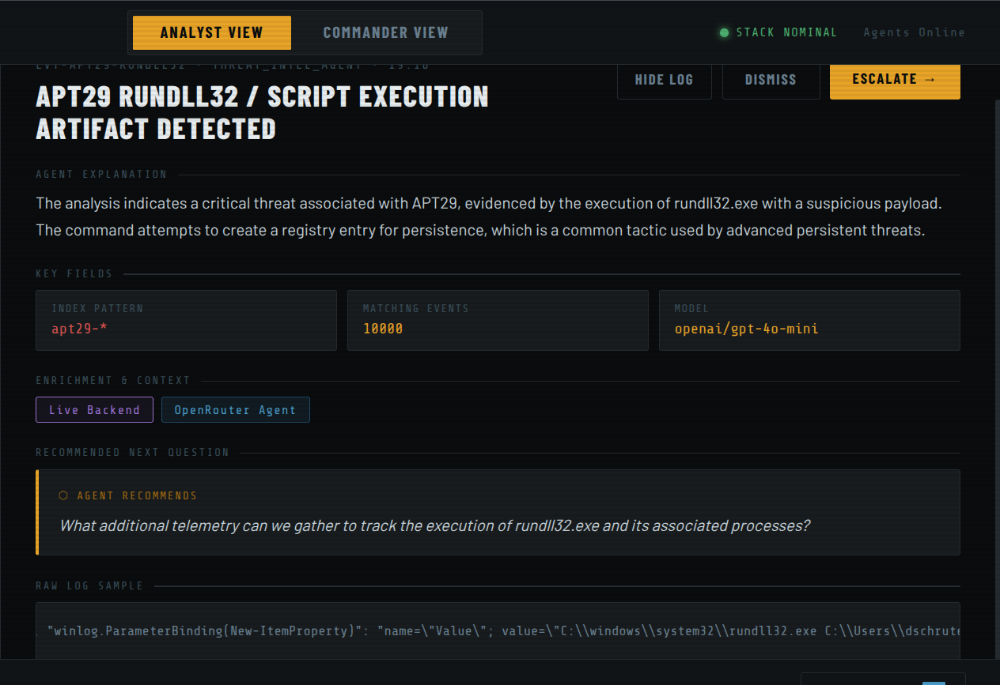

The raw log panel is critical for credibility. Spotter-Shooter should not ask analysts to trust a generated paragraph. The analyst needs to see the underlying event sample and decide whether the agent's interpretation is justified.

This screenshot helps communicate the core product philosophy: AI accelerates triage, but evidence remains visible and reviewable.

**Suggested capture:** the same Analyst View finding with the raw log sample expanded.

---

### 7. Escalation — turning a lead into a case

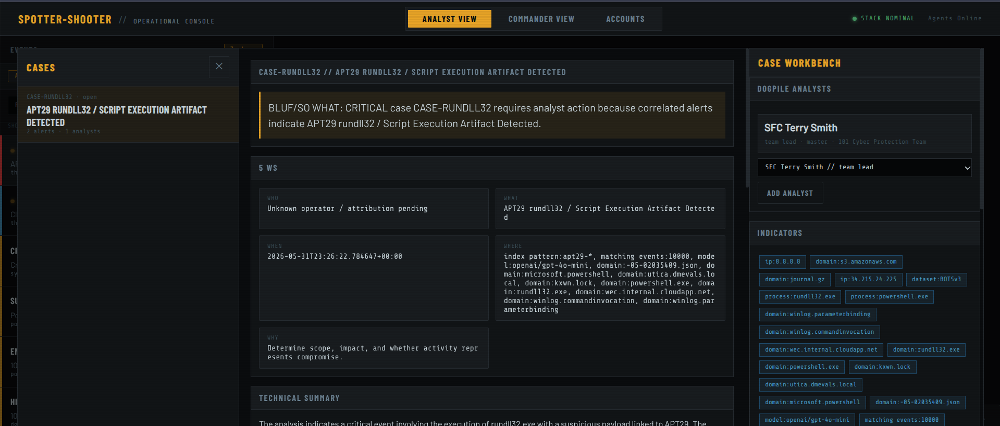

When an analyst validates a finding, they can escalate it into a case. This creates a clean handoff from agent-generated lead to human-reviewed operational work.

This is the “shooter” side of Spotter-Shooter: agents spot the opportunity, but the analyst makes the decision to escalate, dismiss, or continue pivoting.

**Suggested capture:** a finding after escalation with the created case visible in the active cases drawer.

---

### 8. Commander View — leadership visibility

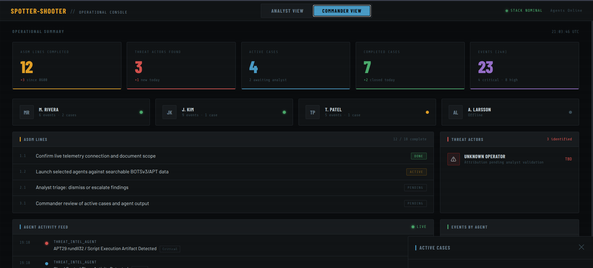

Commander View gives leaders a concise operational picture without forcing them into raw logs. It shows ASOM-style progress, active cases, agent activity, and events grouped by agent.

This view is designed for supervisors, team leads, and incident commanders who need to understand what the team knows, what is still uncertain, and where analyst attention is going.

**Suggested capture:** Commander View showing ASOM lines, agent activity feed, and events by agent.

---

### 9. Agent Admin — managing the hunting team

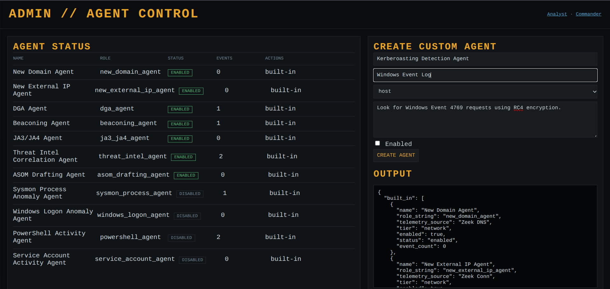

The admin panel shows that Spotter-Shooter is an agent framework, not a fixed demo. Operators can view built-in agents, see status and event counts, create custom agents, test them against Elastic, enable or disable them, and archive agents that are no longer needed.

This is especially useful for adapting the platform to a specific mission, environment, or supervisor-directed hunt objective.

**Suggested capture:** `/admin/agents` showing built-in agent statuses and the custom-agent creation/test controls.

---

### 10. Kibana dataset view — independent verification

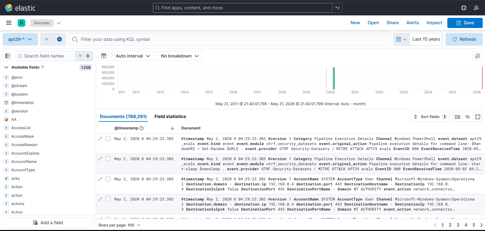

A Kibana screenshot helps independently prove the lab's scale. It shows that the platform is backed by realistic data volume rather than a tiny curated demo set.

For analyst-vs-agent comparisons, this is important context: both human analysts and agents are being evaluated against large, noisy telemetry, not a handful of hand-picked events.

**Suggested capture:** Kibana Discover, data views, or index list showing `botsv3-raw`, `apt29-endpoint`, `apt29-zeek`, and related indices.

---


### 11. Case Workbench — analyst dogpile and final output


This screenshot should show a case with multiple linked alerts, BLUF, 5 Ws, indicators, timeline entries, and final output. It proves Spotter-Shooter can move from alert triage into structured case work.

**Suggested capture:** `CASE-RUNDLL32` or another escalated finding with the case workbench open.

---

### 12. Account and CPT administration

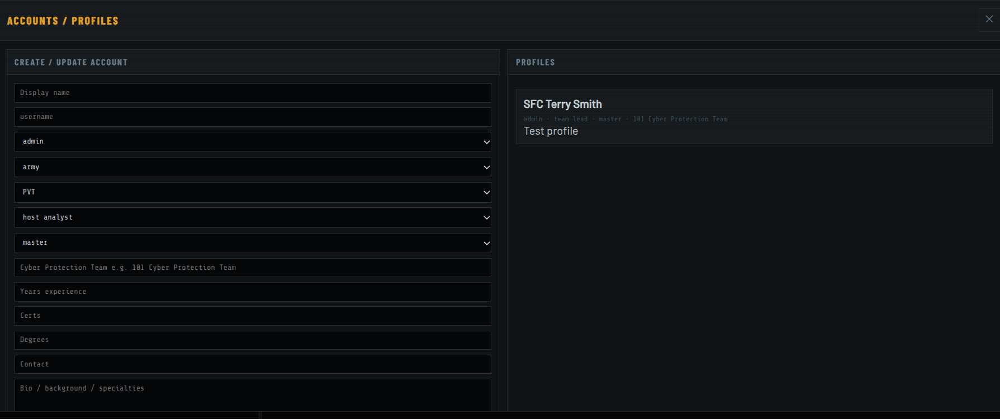

This screenshot should show the admin/account panel with analyst profile fields and the Cyber Protection Team editor. It demonstrates how personnel, rank, work role, skill level, and CPT membership become part of case attribution and commander visibility.

**Suggested capture:** account form plus seeded CPT/NCPT list.

---

### 13. Analyst / Commander chatbot

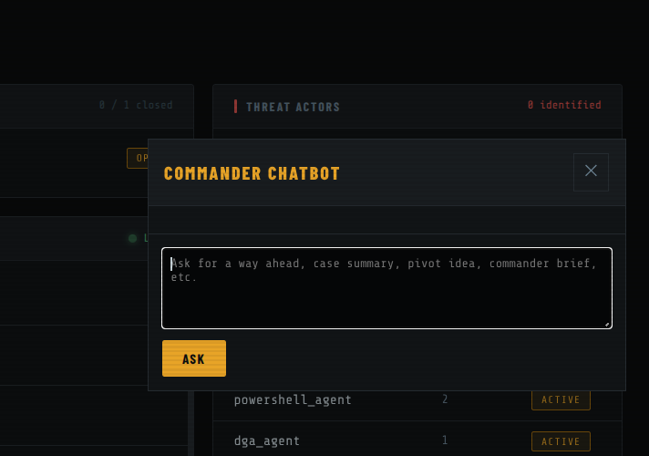

This screenshot should show the chatbot answering a case or commander-briefing question and suggesting a way ahead.

**Suggested capture:** ask "What should the analyst do next on this case?" or "Summarize this for a commander."

---

### 14. PCAP upload to Zeek


This screenshot should show a PCAP upload completing and creating a `spotter-zeek-*` index with Zeek log types such as `conn`, `dns`, and `packet_filter`.

---

## Analyst-vs-agent evaluation docs

This repository includes two practical evaluation guides:

- [`docs/apt29-evaluation-guide.md`](docs/apt29-evaluation-guide.md)
- [`docs/botsv3-walkthrough.md`](docs/botsv3-walkthrough.md)

Use these to compare:

- human analyst hunt time
- agent time to first lead
- pivot quality
- false positive rate
- evidence quality
- final narrative quality

---

## Elastic data model

The recommended model is **bring your own Elastic**.

Why this is better than shipping a preloaded Elastic stack in the default deployment:

- BOTSv3 and APT datasets are large; automatic import can take significant time, disk, and memory.
- Some environments need air-gapped or customer-controlled data handling.
- Public users should never be pointed at a maintainer's private lab.
- Teams can compare analysts and agents against their own telemetry or against locally imported public datasets.

For convenience, this repository includes evaluation guides for APT29 and BOTSv3, but the dataset import is intentionally an operator-controlled setup step rather than an automatic connection to a hosted lab.

---

## SSH forwarding demo mode

The demo deployment can be bound to server loopback only. It does not need to be publicly served.

Forward the app from a workstation:

```bash
ssh -L 8097:127.0.0.1:8097 USER@SERVER_IP
```

Then open:

```text
http://127.0.0.1:8097
```

Useful demo routes:

```text
http://127.0.0.1:8097/
http://127.0.0.1:8097/operations.html?view=analyst
http://127.0.0.1:8097/operations.html?view=commander
http://127.0.0.1:8097/admin/agents
```

---

## Quick start

```bash
./deploy.sh
```

Health check:

```bash
curl http://127.0.0.1:8097/api/health
```

Agent status:

```bash
curl http://127.0.0.1:8097/api/agents
```

Launch a hunt:

```bash
curl -X POST http://127.0.0.1:8097/api/setup/launch \
  -H 'Content-Type: application/json' \
  -d '{}'
```

---


## 25 critiques and future improvements

1. Replace MVP token auth with hardened session management, CSRF protection, refresh-token rotation, and secure cookies.
2. Wire the email/SMS two-factor flow to production providers and add backup codes.
3. Add password reset, account lockout, and audit trails for failed login attempts.
4. Move account/team administration into a dedicated admin route with stricter role checks and route guards.
5. Add per-route authorization tests so analysts can only edit themselves while admins can edit all accounts and teams.
6. Add full CRUD edit forms for existing accounts and teams, not only create/upsert forms.
7. Add file upload/storage for team logos instead of only accepting a logo URL.
8. Add formal organization hierarchy support for battalion/brigade/mission partner relationships.
9. Make CPT/NCPT naming configurable for non-Army or joint environments.
10. Add a real notification system for admin requests and analyst mentions inside a case.
11. Add chain-of-custody/audit logs for every case edit, indicator edit, alert attachment, and final-output regeneration.
12. Add case status workflow gates such as open, triage, evidence review, commander review, closed, and archived.
13. Add analyst confidence voting and dissenting opinions on case conclusions.
14. Add full-text search across cases, indicators, timeline entries, accounts, and teams.
15. Add saved KQL/DSL pivots that open directly in Kibana Discover with time range and query prefilled.
16. Add enrichment result caching and provider-specific rate-limit handling.
17. Add OpenCTI object mapping for indicators, reports, intrusion sets, malware, and relationships.
18. Add STIX/TAXII import/export for case indicators and final products.
19. Add ATT&CK technique mapping and coverage views per agent and per case.
20. Add false-positive learning loops so dismissed findings improve future agent scoring.
21. Add background job tracking for long-running PCAP imports, dataset imports, and large Elastic searches.
22. Add regression tests for UI flows: login, account self-edit, admin edit, team creation, escalation, case dogpile, and chatbot.
23. Add synthetic demo data reset scripts so tests do not leave stray cases/accounts behind.
24. Add production deployment hardening: TLS, backup/restore, database migrations, secrets management, and resource limits.
25. Add commander-ready export formats: Markdown, PDF, DOCX, and briefing-slide outlines.

---

## Status

This is an MVP/prototype intended for evaluation, demos, and controlled analyst-vs-agent experiments. It is not yet a hardened production SOC platform.

Current focus:

- prove value on realistic security datasets
- measure agent acceleration against human analysts
- improve custom agent authoring
- improve evidence-grounded reporting
- reduce false positives through analyst feedback

## Admin-controlled Kibana and security settings

No private Kibana URL is shipped in the app. `Go To Kibana` reads the URL configured during deployment or from Operational Console → Admin Tools. If blank, the button tells the admin to configure Kibana instead of opening an external site. Admin Tools also exposes PCAP upload and 2FA opt-in/opt-out controls, and is hidden from non-admin users.
